# Honeypot Deployment and Analysis using T-Pot on Azure

## Table of Contents
- [Prerequisites](#prerequisites)
- [Step 1: Create a Virtual Machine in Azure](#step-1-create-a-virtual-machine-in-azure)
- [Step 2: Configure the VM Network](#step-2-configure-the-vm-network)
- [Step 3: Connect to the VM Using PuTTY](#step-3-connect-to-the-vm-using-putty)
- [Step 4: Install T-Pot](#step-4-install-t-pot)
- [T-Pot Dashboard Overview](#t-pot-dashboard-overview)
- [Key Components of the Dashboard](#key-components-of-the-dashboard)
- [Conclusion](#conclusion)

---

## Prerequisites
- Download [PuTTY](https://www.putty.org/) on your host machine.
- Create an account on the [Azure Portal](https://portal.azure.com/).

---

## Step 1: Create a Virtual Machine in Azure

1. Navigate to **Azure Services > Virtual Machines**.
2. Click **Add** to create a new virtual machine with the following specifications:

| Setting                | Value                               |
|------------------------|-------------------------------------|
| Resource Group Name    | *(Your choice)*                     |
| VM Name                | *(Your choice)*                     |
| Image                  | Ubuntu Server 24.04 LTS - x64 Gen2  |
| Size                   | Standard_D4s_v3 (4 vCPUs, 16 GiB RAM) |
| Authentication Type    | Password (set a username and password) |

**Disk Configuration:**
- OS Disk Type: 256 GiB (P15)

> Leave all other settings as default, then click **Review + Create**.

**Screenshot:**
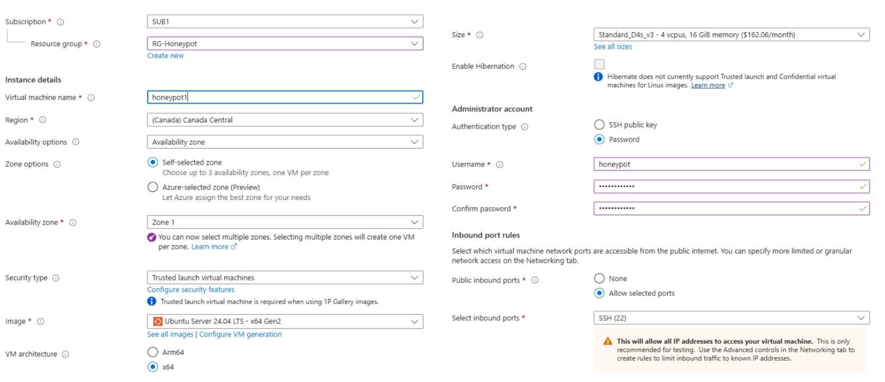

---

## Step 2: Configure the VM Network

After deployment:
1. Navigate to your VM > **Networking**.
2. Create an **Inbound Port Rule**:
   - Destination Port Ranges: `1-65535`
   - Other settings: Keep default.

> This ensures that T-Pot services are fully accessible.

**Screenshot:**
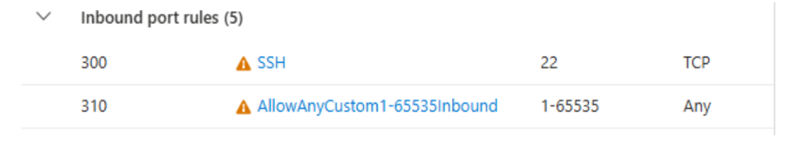

---

## Step 3: Connect to the VM Using PuTTY

1. Copy your VM's **Public IP Address**.
2. Open PuTTY > Paste the IP Address > Click **Open**.
3. Log in with the username and password created earlier.

Update the system and install Git:
```bash
sudo apt update
sudo apt upgrade -y
sudo apt install git
```

**Screenshot:**
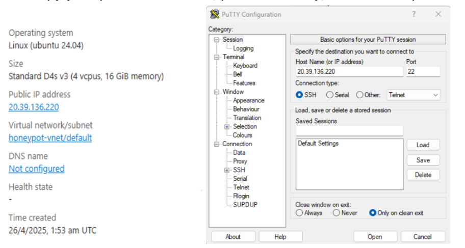

---

## Step 4: Install T-Pot

1. Clone the T-Pot repository:
```bash
git clone https://github.com/telekom-security/tpotce.git
```

2. Navigate into the repository:
```bash
cd tpotce
```

3. Run the installation script:
```bash
sudo ./install.sh
```

During installation:
- Select `(H)ive Type`: **T-Pot Standard**.
- Set a **T-Pot Web Username and Password**.

After installation, reboot the VM:
```bash
sudo reboot
```

> After rebooting, access the T-Pot Dashboard at: `https://<your-public-ip>:64297`

**Screenshot:**
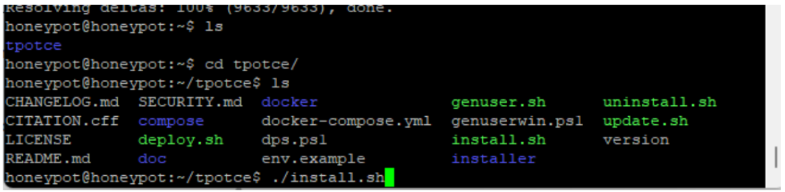
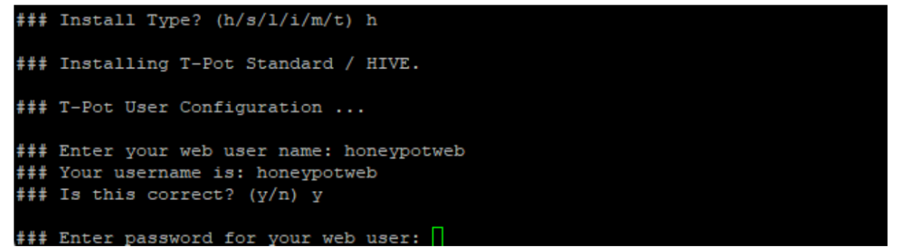

---

# T-Pot Dashboard Overview

The T-Pot honeypot platform provides a comprehensive dashboard integrating multiple tools for monitoring, analyzing, and visualizing attack data. It allows tracking live attacks, analyzing captured traffic, visualizing trends, and gathering intelligence on potential threats.

**Screenshot:**
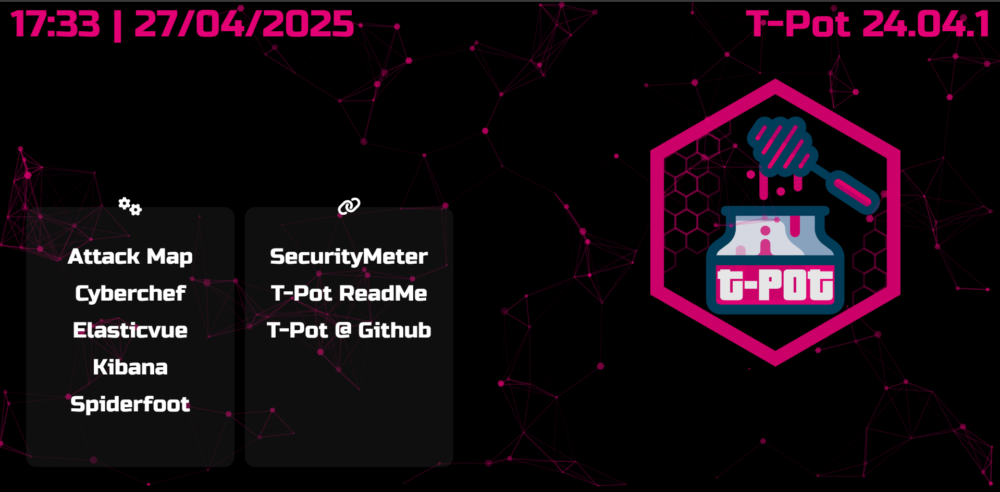

---

# Key Components of the Dashboard

## Attack Map
Displays live geographic locations and types of attacks targeting the honeypot.

**Screenshot:**
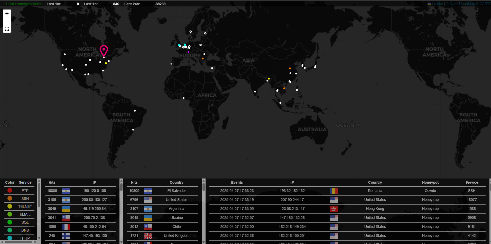

---

## Elasticvue
Elasticvue is an Elasticsearch client used to search, filter, and visualize collected attack data.

**Screenshot:**
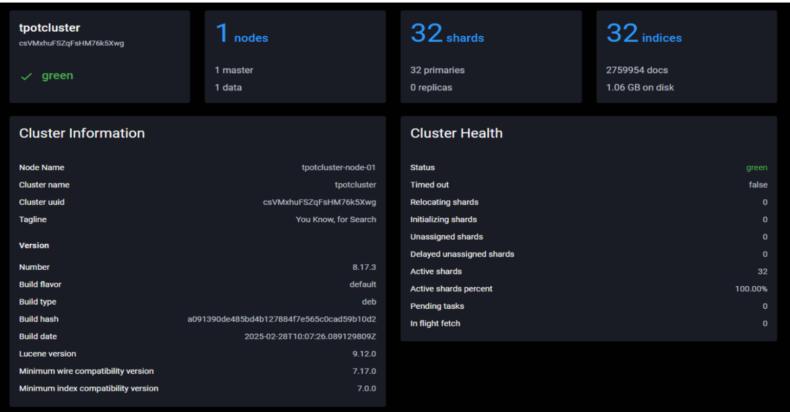

**Screenshot:**
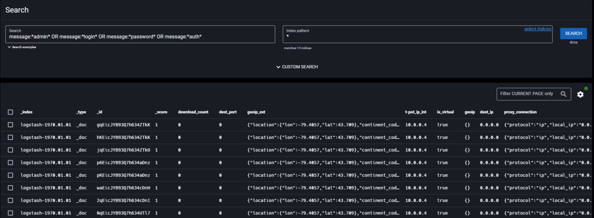

---

## Kibana
Kibana allows creating custom dashboards and reports based on honeypot data.

**Screenshot:**
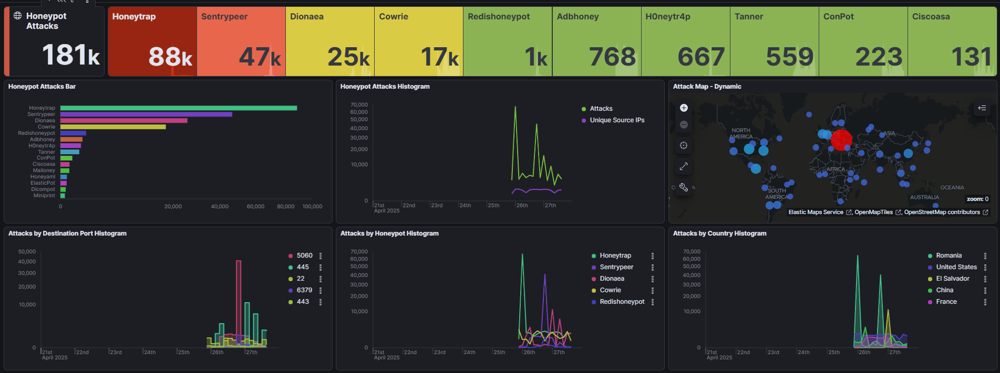

**Screenshot:**
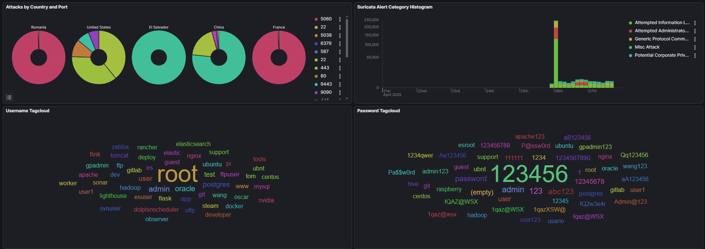

**Screenshot:**
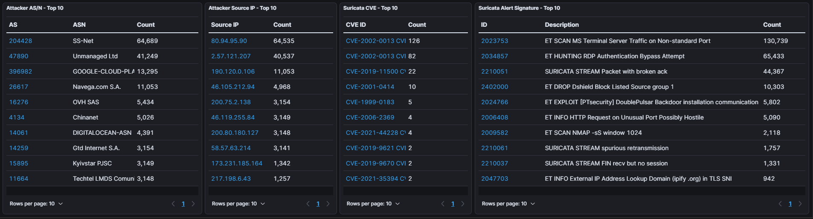

---

## SpiderFoot
SpiderFoot is an OSINT tool for gathering information about attackers (IP addresses, domains, emails).

**Screenshot:**
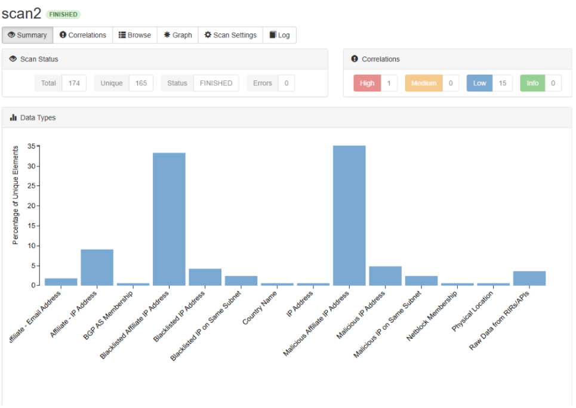

**Screenshot:**
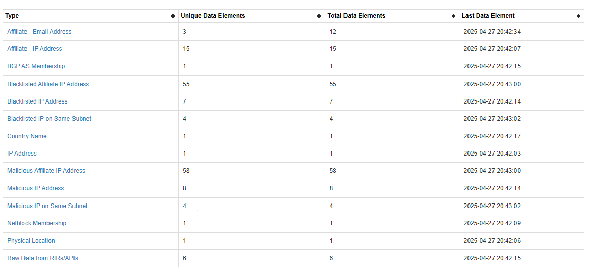

**Screenshot:**
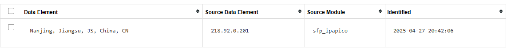

---

## CyberChef
CyberChef is a web-based tool for analyzing and decoding captured data, integrated closely into T-Pot.

---

# Conclusion

By deploying T-Pot on Azure and analyzing the captured data through its integrated dashboard, valuable insights into real-world attack patterns, sources, and techniques can be obtained. Honeypots like T-Pot are essential tools for cybersecurity research, education, and incident response.

---

> **Note:** Replace all `path_to_image` with your actual image file paths once you upload them to GitHub.
